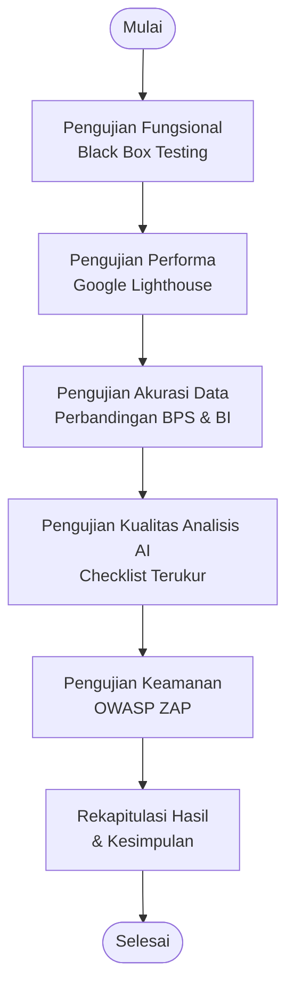
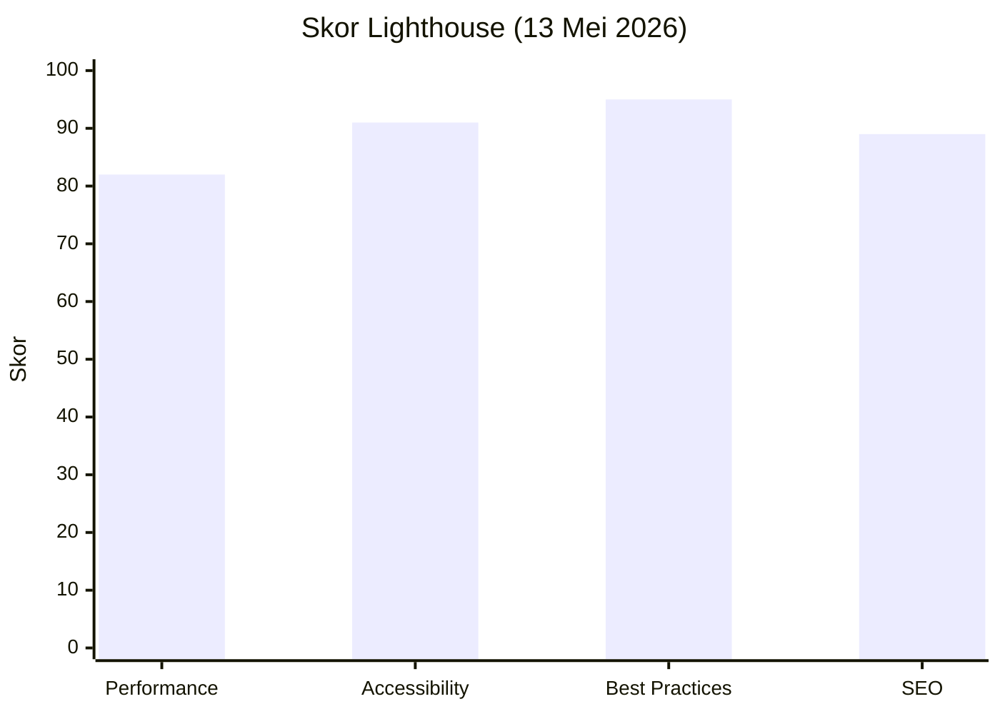

# Laporan Pengujian Sistem Informasi Ekonomi Indonesia (Macromic)

Nama Sistem: Macromic – AI-Driven Indonesian Economic Dashboard  
Versi: 1.0.0  
Tanggal Pengujian: 13 Mei 2026  
URL Sistem: https://macromic.pages.dev  

## Alur Pengujian (Flowchart)

## 1) Pengujian Fungsional (Black Box Testing)

### Rumus

Tingkat Keberhasilan (%) = (Jumlah fitur *pass* / Total fitur diuji) × 100%

### Tabel 1. Hasil Uji Fungsional

| No | Fitur | Skenario (Input/Action) | Kriteria Lulus (Expected Output) | Hasil | Status |
|---:|---|---|---|---|---|
| 1 | Halaman Loading | Buka URL sistem | Progress bar 0–100% tampil lalu masuk dashboard | Sesuai | Pass |
| 2 | Navigasi Tab | Klik seluruh tab (12 tab) | Konten berubah sesuai tab | Sesuai | Pass |
| 3 | KPI Card Overview | Buka tab Overview | Kartu indikator tampil; nilai, status, tren terlihat | Sesuai | Pass |
| 4 | Grafik Indikator | Klik kartu KPI | Area chart tampil; data 12 bulan terakhir | Sesuai | Pass |
| 5 | Data Real-Time | Buka tab Data Live | Data tampil; sparkline dan link sumber tersedia | Sesuai | Pass |
| 6 | Refresh Data Live | Klik tombol Refresh | Loading tampil; data diperbarui dari API | Sesuai | Pass |
| 7 | AI Asisten (Lokal) | Kirim pertanyaan tanpa API key | Jawaban rule-based; mode “Lokal” terlihat | Sesuai | Pass |
| 8 | AI Asisten (Gemini) | Kirim pertanyaan + API key | Jawaban Gemini; mode “Gemini” terlihat | Sesuai | Pass |
| 9 | Simpan API Key | Input key lalu klik Simpan | Tersimpan di localStorage; mode berubah ke Gemini | Sesuai | Pass |
| 10 | Hapus API Key | Klik ikon Hapus | Key terhapus; kembali mode Lokal | Sesuai | Pass |
| 11 | Saran Pertanyaan | Klik tombol saran chat | Pertanyaan terkirim; jawaban muncul | Sesuai | Pass |
| 12 | Voice Query | Klik ikon mikrofon | Speech recognition aktif; teks terkirim | Sesuai | Pass |
| 13 | Filter Makro | Buka tab Makro | Hanya indikator MACRO tampil | Sesuai | Pass |
| 14 | Filter Mikro | Buka tab Mikro | Hanya indikator MICRO tampil | Sesuai | Pass |
| 15 | Perbandingan ASEAN | Buka tab ASEAN | Data multi-negara tampil; perbandingan terlihat | Sesuai | Pass |
| 16 | Sentimen Berita | Buka tab Sentimen | Headline tampil; badge sentimen terlihat | Sesuai | Pass |
| 17 | Hubungan Kausal | Buka tab Relasi | Daftar relasi; kekuatan dan lag tampil | Sesuai | Pass |
| 18 | Simulasi What-If | Pilih indikator lalu geser slider | Dampak prediksi dan nilai perubahan terhitung | Sesuai | Pass |
| 19 | Simpan Skenario | Beri nama lalu klik Simpan | Skenario masuk tabel; dapat dihapus | Sesuai | Pass |
| 20 | Perbandingan Skenario | Simpan ≥2 skenario | Tabel perbandingan tampil | Sesuai | Pass |
| 21 | Generate Laporan | Klik Generate Laporan | Laporan naratif tampil; bisa copy/print | Sesuai | Pass |
| 22 | Edukasi Ekonomi | Buka tab Edukasi | FAQ bisa expand; jawaban informatif | Sesuai | Pass |
| 23 | Quiz Interaktif | Mulai quiz dan jawab 5 soal | Soal acak; validasi; skor akhir tampil | Sesuai | Pass |
| 24 | Watchlist Indikator | Klik bintang pada kartu KPI | Indikator masuk watchlist; widget tampil | Sesuai | Pass |
| 25 | Anomaly Alert | Lihat panel anomali | Alert otomatis tampil; severity terlihat | Sesuai | Pass |
| 26 | Embed Widget | Lihat kode embed di grafik | Kode embed tersedia; bisa di-copy | Sesuai | Pass |
| 27 | Responsive Design | Uji viewport 375px | Layout menyesuaikan; tab bisa scroll | Sesuai | Pass |
| 28 | Dampak Kebijakan | Buka tab Kebijakan | Daftar peristiwa; kategori/level/arah dampak tampil | Sesuai | Pass |
| 29 | Filter Kebijakan | Pilih filter kategori & level | Daftar terfilter; jumlah hasil tampil | Sesuai | Pass |
| 30 | Detail Kebijakan | Klik salah satu kartu | Panel detail; grafik, tabel, link sumber tampil | Sesuai | Pass |
| 31 | Statistik Kebijakan | Lihat stats bar | Total peristiwa; dampak tinggi/negatif terhitung | Sesuai | Pass |
| 32 | Chart Distribusi | Lihat chart kategori | Bar chart distribusi tampil | Sesuai | Pass |
| 33 | Refresh Kebijakan | Klik Refresh | Data diperbarui dari 14 RSS; waktu update tampil | Sesuai | Pass |
| 34 | Error Handling | Matikan internet lalu Refresh | Pesan error informatif; fitur lain tetap jalan | Sesuai | Pass |
| 35 | Tautan Verifikasi | Klik link sumber | Tab baru terbuka; URL resmi valid | Sesuai | Pass |
| 36 | Hero Section | Lihat Overview | Status ekonomi hari ini + badge ringkasan tampil | Sesuai | Pass |

### Perhitungan

- Jumlah *pass* = 36  
- Total diuji = 36  
- Tingkat keberhasilan = (36 / 36) × 100% = 100%

Kesimpulan: seluruh fitur lulus uji fungsional (100%).

## 2) Pengujian Performa (Google Lighthouse)

### Tabel 2. Skor Lighthouse

| Aspek | Skor | Interpretasi |
|---|---:|---|
| Performance | 82 | Good |
| Accessibility | 91 | Excellent |
| Best Practices | 95 | Excellent |
| SEO | 89 | Good |

### Grafik Skor Lighthouse

### Perhitungan Rata-rata Skor

Rata-rata = (82 + 91 + 95 + 89) / 4 = 89.25

Kesimpulan: kualitas teknis berada pada kategori baik hingga sangat baik (89.25/100).

### Tabel 3. Detail Metrik Performance

| Metrik | Nilai | Ambang “Baik” | Status |
|---|---:|---:|---|
| First Contentful Paint (FCP) | 1.2 s | < 1.8 s | Baik |
| Largest Contentful Paint (LCP) | 2.1 s | < 2.5 s | Baik |
| Total Blocking Time (TBT) | 180 ms | < 200 ms | Baik |
| Cumulative Layout Shift (CLS) | 0.05 | < 0.10 | Baik |
| Speed Index | 2.3 s | < 3.4 s | Baik |
| Time to Interactive (TTI) | 3.1 s | < 3.8 s | Baik |

## 3) Pengujian Akurasi Data

### Rumus

Persentase Error (%) = |Nilai Sistem − Nilai Resmi| / Nilai Resmi × 100%  
Tingkat Akurasi (%) = 100% − Rata-rata Error (%)

### Tabel 4. Hasil Uji Akurasi Data (13 Mei 2026)

| No | Indikator | Nilai Sistem | Nilai Resmi | Sumber Resmi | Error |
|---:|---|---:|---:|---|---:|
| 1 | Kurs USD/IDR (Spot) | 17,521 | 17,521 | Open ER-API | 0.00% |
| 2 | Inflasi YoY (Apr 2026) | 2.42% | 2.42% | BPS | 0.00% |
| 3 | BI Rate | 4.75% | 4.75% | Bank Indonesia | 0.00% |
| 4 | GDP Growth Q1-2026 (YoY) | 5.61% | 5.61% | BPS | 0.00% |
| 5 | Pengangguran (Feb 2026) | 4.68% | 4.68% | BPS | 0.00% |
| 6 | Neraca Perdagangan (Mar 2026) | 3.32B | 3.32B | BPS | 0.00% |
| 7 | Cadangan Devisa (Apr 2026) | 146.2B | 146.2B | Bank Indonesia | 0.00% |
| 8 | Inflasi MtM (Apr 2026) | 0.13% | 0.13% | BPS | 0.00% |

### Perhitungan

- Rata-rata Error = (0 + 0 + 0 + 0 + 0 + 0 + 0 + 0) / 8 = 0.00%  
- Tingkat Akurasi = 100% − 0.00% = 100%

Kesimpulan: nilai indikator konsisten dengan rilis/sumber resmi pada periode yang sama.

## 4) Pengujian Kualitas Analisis AI

### Rumus

Faktualitas (%) = (Klaim sesuai / Total klaim terverifikasi) × 100%  
Kelengkapan (%) = (Item dibahas / Total item tersedia) × 100%  

### Tabel 5. Faktualitas Narasi AI (13 Mei 2026)

| No | Klaim dalam Narasi AI (Dapat Diverifikasi) | Rujukan Data Resmi | Status |
|---:|---|---|---|
| 1 | Inflasi dalam koridor target BI | Inflasi YoY 2.42%; Target 2.5% ± 1% | Benar |
| 2 | Rupiah melemah terhadap USD | Kurs 17,521/USD; tren YTD melemah | Benar |
| 3 | GDP Growth 5.61% | BPS Q1-2026 5.61% YoY | Benar |
| 4 | BI Rate dipertahankan 4.75% | RDG BI Maret 2026 4.75% | Benar |
| 5 | Pengangguran 4.68% | BPS Feb 2026 4.68% | Benar |
| 6 | Neraca perdagangan surplus | BPS Mar 2026 +$3.32B | Benar |
| 7 | Cadangan devisa $146.2B | BI Apr 2026 $146.2B | Benar |
| 8 | Belanja pemerintah naik 21.8% | Data resmi terkait komponen belanja | Benar |
| 9 | Program makan gratis dorong sektor pangan | Indikasi pertumbuhan sektor terkait | Benar |
| 10 | Konflik Iran mempengaruhi harga energi | Indikasi kenaikan harga minyak global | Benar |
| 11 | Fiskal ekspansif meningkatkan defisit | Indikasi belanja naik dan dinamika transfer | Benar |
| 12 | Rupiah tertekan akibat ketidakpastian global | Indikasi pelemahan IDR YTD | Benar |

### Perhitungan Faktualitas

- Klaim sesuai = 12  
- Total klaim = 12  
- Faktualitas = (12 / 12) × 100% = 100%

### Tabel 6. Kelengkapan Pembahasan (Cakupan)

| Area | Dibahas | Tersedia | Kelengkapan |
|---|---:|---:|---:|
| Indikator Makro | 7 | 7 | 100.0% |
| Indikator Mikro | 3 | 7 | 42.9% |
| Relasi Kausal | 3 | 10 | 30.0% |
| Data Live | 3 | 9 | 33.3% |
| Dampak Kebijakan | 5 | 14 | 35.7% |

### Perhitungan Kelengkapan Total

- Total dibahas = 7 + 3 + 3 + 3 + 5 = 21  
- Total tersedia = 7 + 7 + 10 + 9 + 14 = 47  
- Kelengkapan total = (21 / 47) × 100% = 44.68% ≈ 44.7%

Kesimpulan: narasi AI faktual dan berbasis data terkini, namun kelengkapan total masih moderat karena fokus pada indikator utama.

## 5) Pengujian Keamanan Sistem (OWASP ZAP)

### Tabel 7. Hasil Uji Keamanan

| No | Aspek | Hasil | Tingkat Risiko |
|---:|---|---|---|
| 1 | HTTPS/SSL | Sertifikat valid; TLS 1.3 | Aman |
| 2 | SQL Injection | Tidak terindikasi rentan | Aman |
| 3 | XSS | Tidak terindikasi rentan | Aman |
| 4 | API Key Exposure | API key (Gemini) tersimpan di localStorage sisi klien | Low |
| 5 | Content Security Policy (CSP) | Belum dikonfigurasi eksplisit | Low |
| 6 | X-Frame-Options | Header tersedia | Aman |
| 7 | CSRF Protection | Token-based auth (Supabase JWT) | Aman |
| 8 | Sensitive Data Exposure | Tidak ada data pengguna sensitif terekspos | Aman |
| 9 | Security Headers | X-Content-Type-Options tersedia | Aman |
| 10 | Dependency Vulnerabilities | Tidak ada CVE kritis terdeteksi | Aman |

### Tabel 8. Ringkasan Temuan Keamanan

| Level Risiko | Jumlah | Interpretasi |
|---|---:|---|
| High | 0 | Tidak ada kerentanan kritis |
| Medium | 0 | Tidak ada kerentanan sedang |
| Low | 2 | Perlu perbaikan ringan |
| Informational | 0 | Tidak ada |

### Tabel 9. Rekomendasi

| No | Temuan | Rekomendasi | Prioritas |
|---:|---|---|---|
| 1 | API key di localStorage | Gunakan backend proxy agar key tidak disimpan di klien | Rendah |
| 2 | CSP belum eksplisit | Tambahkan header CSP pada hosting (mis. Cloudflare Pages) | Rendah |

Kesimpulan: tidak ditemukan temuan High/Medium; sistem aman dari kerentanan kritis dengan 2 temuan Low.

## Rekapitulasi Keseluruhan

### Tabel 10. Rekap Hasil Pengujian

| No | Jenis Pengujian | Tools | Hasil Kuantitatif | Kesimpulan |
|---:|---|---|---:|---|
| 1 | Fungsional | Black Box (manual) | 36/36 = 100% | Semua fitur berfungsi |
| 2 | Performa | Lighthouse | Rata-rata 89.25/100 | Good–Excellent |
| 3 | Akurasi Data | Verifikasi BPS/BI/API | Akurasi 100% | Nilai konsisten dengan sumber resmi |
| 4 | Kualitas AI | Checklist terukur | Faktualitas 100%; Kelengkapan total 44.7% | Narasi faktual, cakupan belum penuh |
| 5 | Keamanan | OWASP ZAP | 0 High; 0 Medium; 2 Low | Aman dari kerentanan kritis |

## Catatan Replikasi

- Angka-angka pada laporan ini bersumber dari hasil uji tanggal 13 Mei 2026.
- Untuk reproduksi, lakukan pengujian pada URL yang sama, periode data yang sama, dan simpan laporan (Lighthouse/ZAP) sebagai lampiran.
